# Projeto Integrador: Rota Vital (Hemovia) — Documentação e Diagramas UML

---

## Sumário
- [Sobre os Diagramas](#sobre-os-diagramas)
- [Guia Rápido de Notação UML](#guia-rápido-de-notação-uml)
- [1. Programação Orientada a Objetos (POO)](#1-programação-orientada-a-objetos-poo)
  - [POO — Unidade 1: Modelo de Domínio, CRUDs e Regras de Validade](#poo--unidade-1-modelo-de-domínio-cruds-e-regras-de-validade)
    - [POOUS01 — Cadastro de Doação e Entrada de Bolsa no Estoque](#poous01--cadastro-de-doação-e-entrada-de-bolsa-no-estoque)
    - [POOUS02 — Cadastro e Controle de Validade das Bolsas de Sangue](#poous02--cadastro-e-controle-de-validade-das-bolsas-de-sangue)
    - [POOUS03 — Gestão de Cadastro de Hospitais](#poous03--gestão-de-cadastro-de-hospitais)
    - [POOUS04 — Emissão de Requisições Hospitalares](#poous04--emissão-de-requisições-hospitalares)
    - [POOUS05 — Tela Inicial da Aplicação (Visão Geral do Sistema)](#poous05--tela-inicial-da-aplicação-visão-geral-do-sistema)
  - [POO — Unidade 2: Aplicação Integrada, Regras de Negócio e Concorrência](#poo--unidade-2-aplicação-integrada-regras-de-negócio-e-concorrência)
    - [POOUS06 — Processamento e Matching de Requisições (Compatibilidade + FEFO)](#poous06--processamento-e-matching-de-requisições-compatibilidade--fefo)
    - [POOUS07 — Integração com Módulo de Roteirização e Exibição de Rotas](#poous07--integração-com-módulo-de-roteirização-e-exibição-de-rotas)
    - [POOUS08 — Integração dos Painéis de Monitoramento e Estatística](#poous08--integração-dos-painéis-de-monitoramento-e-estatística)
    - [POOUS09 — Início de Transporte e Monitoramento de Cadeia Fria](#poous09--início-de-transporte-e-monitoramento-de-cadeia-fria)
    - [POOUS10 — Cancelamento de Requisição com Liberação Automática de Estoque](#poous10--cancelamento-de-requisição-com-liberação-automática-de-estoque)
    - [POOUS11 — Confirmação do Recebimento e Baixa de Entrega](#poous11--confirmação-do-recebimento-e-baixa-de-entrega)
    - [POOUS12 — Bloqueio de Concorrência na Reserva Simultânea de Bolsas](#poous12--bloqueio-de-concorrência-na-reserva-simultânea-de-bolsas)
- [2. Algoritmos e Estruturas de Dados (AED)](#2-algoritmos-e-estruturas-de-dados-aed)
  - [AED — Unidade 1: Estruturas de Dados Básicas de Domínio](#aed--unidade-1-estruturas-de-dados-básicas-de-domínio)
    - [AEDUS01 — Fila de Processamento de Requisições Hospitalares](#aedus01--fila-de-processamento-de-requisições-hospitalares)
    - [AEDUS02 — Estrutura de Lista para Armazenamento Geral de Bolsas no Estoque](#aedus02--estrutura-de-lista-para-armazenamento-geral-de-bolsas-no-estoque)
    - [AEDUS03 — Pilha de Histórico e Reversão de Operações de Estoque (Undo Log)](#aedus03--pilha-de-histórico-e-reversão-de-operações-de-estoque-undo-log)
  - [AED — Unidade 2: Algoritmos Avançados e Otimização](#aed--unidade-2-algoritmos-avançados-e-otimização)
    - [AEDUS04 — Roteirização e Caminho Mínimo por Grafo (Dijkstra)](#aedus04--roteirização-e-caminho-mínimo-por-grafo-dijkstra)
    - [AEDUS05 — Priorização de Validade por FEFO (Heap / Fila de Prioridade)](#aedus05--priorização-de-validade-por-fefo-heap--fila-de-prioridade)
    - [AEDUS06 — Indexação de Estoque por Tabela Hash](#aedus06--indexação-de-estoque-por-tabela-hash)
    - [AEDUS07 — Matriz de Compatibilidade Sanguínea ABO/Rh](#aedus07--matriz-de-compatibilidade-sanguínea-aborh)
    - [AEDUS08 — Ordenação por MergeSort/QuickSort para Relatório de Validades](#aedus08--ordenação-por-mergesortquicksort-para-relatório-de-validades)
    - [AEDUS09 — Busca Binária em Vetor Estático de Hospitais Indexados](#aedus09--busca-binária-em-vetor-estático-de-hospitais-indexados)
    - [AEDUS10 — Buffer Circular em Memória para Leitura de Telemetria](#aedus10--buffer-circular-em-memória-para-leitura-de-telemetria)
- [3. Estatística e Probabilidade (EST)](#3-estatística-e-probabilidade-est)
  - [EST — Unidade 1: Análise Descritiva e Painel Inicial](#est--unidade-1-análise-descritiva-e-painel-inicial)
    - [ESTUS01 — Análise Descritiva do Estoque por Tipo Sanguíneo e Componente](#estus01--análise-descritiva-do-estoque-por-tipo-sanguíneo-e-componente)
    - [ESTUS02 — Métricas de Tendência Central e Dispersão para Demanda](#estus02--métricas-de-tendência-central-e-dispersão-para-demanda)
    - [ESTUS03 — Análise de Tempos de Atendimento e Entrega Logística](#estus03--análise-de-tempos-de-atendimento-e-entrega-logística)
  - [EST — Unidade 2: Análise Probabilística e Modelagem](#est--unidade-2-análise-probabilística-e-modelagem)
    - [ESTUS04 — Análise Probabilística de Desabastecimento por Tipo Sanguíneo](#estus04--análise-probabilística-de-desabastecimento-por-tipo-sanguíneo)
    - [ESTUS05 — Cálculo da Taxa de Descarte por Vencimento de Validade](#estus05--cálculo-da-taxa-de-descarte-por-vencimento-de-validade)
    - [ESTUS06 — Previsão Simples de Demanda por Média Móvel / Regressão](#estus06--previsão-simples-de-demanda-por-média-móvel--regressão)
    - [ESTUS07 — Painel Consolidado de Indicadores e Integração REST](#estus07--painel-consolidado-de-indicadores-e-integração-rest)
- [4. Infraestrutura de Software (SO)](#4-infraestrutura-de-software-so)
  - [SO — Unidade 1: CI/CD, Deploy Inicial e Concorrência](#so--unidade-1-cicd-deploy-inicial-e-concorrência)
    - [SOUS01 — Esteira de Integração e Entrega Contínua (Pipeline CI/CD)](#sous01--esteira-de-integração-e-entrega-contínua-pipeline-cicd)
    - [SOUS02 — Deploy Contínuo e Publicação da Aplicação em Nuvem](#sous02--deploy-contínuo-e-publicação-da-aplicação-em-nuvem)
    - [SOUS03 — Processamento Concorrente Multi-Thread para Telemetria](#sous03--processamento-concorrente-multi-thread-para-telemetria)
  - [SO — Unidade 2: Arquitetura, Cenários e Sincronização](#so--unidade-2-arquitetura-cenários-e-sincronização)
    - [SOUS04 — Sincronização e Prevenção de Condições de Corrida](#sous04--sincronização-e-prevenção-de-condições-de-corrida)
    - [SOUS05 — Dimensionamento e Modelagem para Três Cenários de Carga](#sous05--dimensionamento-e-modelagem-para-três-cenários-de-carga)
    - [SOUS06 — Estimativa e Planilha de Orçamento da Infraestrutura em Nuvem](#sous06--estimativa-e-planilha-de-orçamento-da-infraestrutura-em-nuvem)
    - [SOUS07 — Rollback Automatizado no Pipeline de Deploy](#sous07--rollback-automatizado-no-pipeline-de-deploy)
- [5. Infraestrutura de Comunicação / Redes (RSD)](#5-infraestrutura-de-comunicação--redes-rsd)
  - [RSD — Unidade 1: Topologia, Requisitos e Protocolos](#rsd--unidade-1-topologia-requisitos-e-protocolos)
    - [RSDUS01 — Projeto da Topologia de Rede da Hemorrede](#rsdus01--projeto-da-topologia-de-rede-da-hemorrede)
    - [RSDUS02 — Mapeamento de Requisitos de Negócio em Requisitos Técnicos](#rsdus02--mapeamento-de-requisitos-de-negócio-em-requisitos-técnicos)
    - [RSDUS03 — Especificação dos Protocolos e Contratos de Telemetria](#rsdus03--especificação-dos-protocolos-e-contratos-de-telemetria)
  - [RSD — Unidade 2: Benchmarking, Painel de Rede e Implantação](#rsd--unidade-2-benchmarking-painel-de-rede-e-implantação)
    - [RSDUS04 — Benchmarking de Métricas de Rede (Latência, Vazão e Perda)](#rsdus04--benchmarking-de-métricas-de-rede-latência-vazão-e-perda)
    - [RSDUS05 — Monitoramento das Taxas de Erro HTTP (4xx e 5xx)](#rsdus05--monitoramento-das-taxas-de-erro-http-4xx-e-5xx)
    - [RSDUS06 — Painel de Monitoramento da Qualidade de Rede e Telemetria](#rsdus06--painel-de-monitoramento-da-qualidade-de-rede-e-telemetria)
    - [RSDUS07 — Plano de Migração e Implantação do Ambiente de Rede](#rsdus07--plano-de-migração-e-implantação-do-ambiente-de-rede)
    - [RSDUS08 — Implantação do Ambiente de Comunicação em Produção](#rsdus08--implantação-do-ambiente-de-comunicação-em-produção)

---

## Sobre os Diagramas

Esta documentação contém os **Diagramas UML de Estados e Atividades (Mermaid `stateDiagram-v2`)** modelados para cobrir todas as **44 Histórias de Usuário** do projeto HemovIA (Rota Vital), distribuídas pelas 5 disciplinas do 3º Semestre de ADS (CESAR School).

Cada diagrama mapeia:
1. **O Fluxo Principal (Caminho Feliz / Critério de Aceitação Positivo)**;
2. **Os Fluxos de Exceção e Erro (Cenários Negativos, Validações e Regras de Negócio)**;
3. **Decisões lógicas, transições de estado de entidades e subprocessos compostos**.

---

## Guia Rápido de Notação UML

| Formato da Forma | Descrição | Exemplo no HemovIA |
| :--- | :--- | :--- |
| 🔵 `[*]` (Início) | Ponto de entrada do fluxo | Recepção de requisição REST ou evento de sensor |
| ⚫ `[*]` (Fim) | Término do fluxo | Resposta HTTP (200, 201, 400, 422) ou conclusão |
| ⬛ `Bloco Simples` | Ação ou Estado atômico | Alteração de status da bolsa, persistência no banco |
| 🔷 `Transição com [Condição]` | Decisão lógica (if/else) | "Validade expirada?", "Saldo suficiente?", "Lock obtido?" |
| 🟦 `Bloco Composto { ... }` | Subprocesso detalhado | Agrupamento de validações internas ou regras de domínio |

---

# 1. Programação Orientada a Objetos (POO)

## POO — Unidade 1: Modelo de Domínio, CRUDs e Regras de Validade

---

### POOUS01 — Cadastro de Doação e Entrada de Bolsa no Estoque
* **Cenário Positivo:** Registro de doação válido gera entidade com UUID e insere bolsa com status `AVAILABLE`.
* **Cenário Negativo:** Dados sintéticos incompletos disparam erro de validação e retornam HTTP `400 Bad Request`.

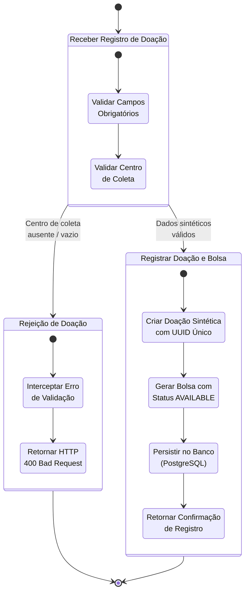

---

### POOUS02 — Cadastro e Controle de Validade das Bolsas de Sangue
* **Cenário Positivo:** Bolsa com validade futura é cadastrada com sucesso com status `AVAILABLE`.
* **Cenário Negativo:** Tentativa de cadastrar bolsa com data retroativa lança `BloodBagExpiredException` e aborta.

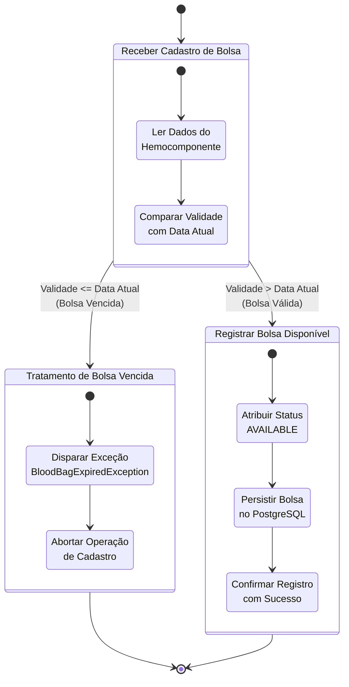

---

### POOUS03 — Gestão de Cadastro de Hospitais
* **Cenário Positivo:** Inserção de dados hospitalares válidos (nome, cidade, lat/long) persiste a entidade no PostgreSQL.
* **Cenário Negativo:** Coordenadas fora do padrão (-90..90, -180..180) resultam em rejeição e HTTP `400 Bad Request`.

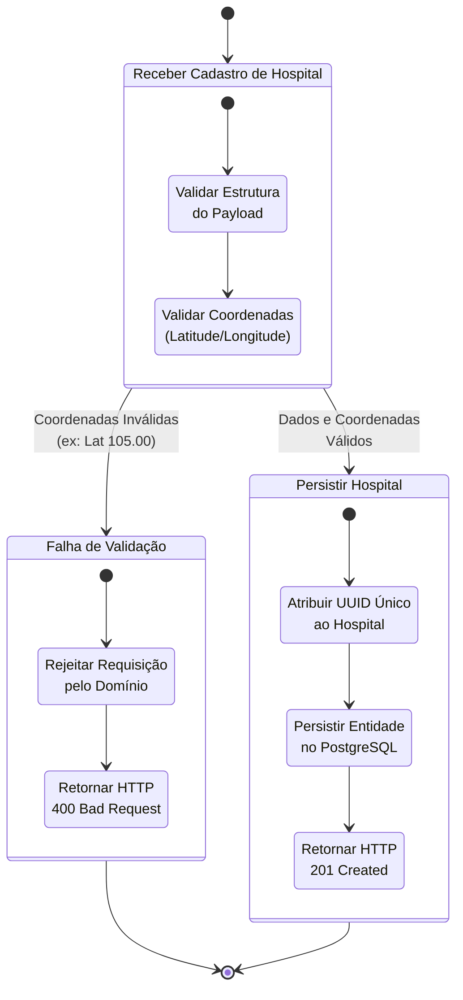

---

### POOUS04 — Emissão de Requisições Hospitalares
* **Cenário Positivo:** Hospital emite pedido com quantidade e tipo válidos; requisição é salva com status `PENDING`.
* **Cenário Negativo:** Quantidade menor ou igual a zero é rejeitada pelo validador do Spring Boot com HTTP `400 Bad Request`.

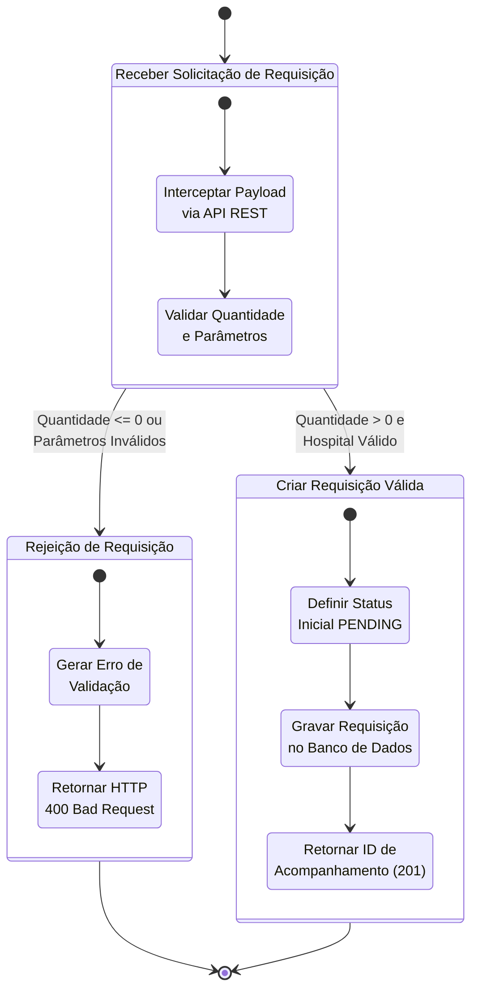

---

### POOUS05 — Tela Inicial da Aplicação (Visão Geral do Sistema)
* **Cenário Positivo:** Consulta inicial retorna resumo consolidado do banco (total de bolsas, requisições pendentes e status operacional).
* **Cenário Negativo:** Falha de comunicação com o PostgreSQL exibe estado degradado amigável sem interromper a execução.

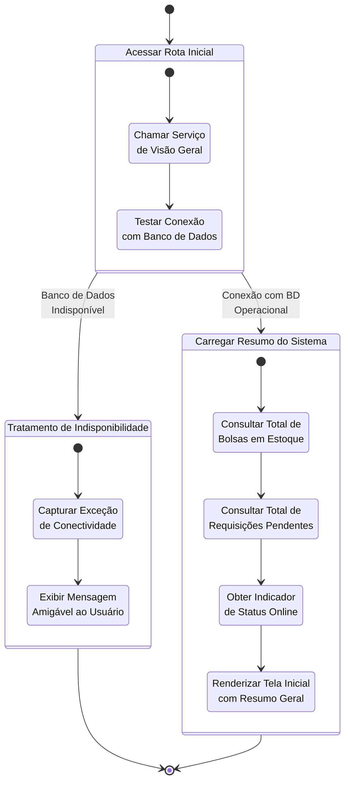

---

## POO — Unidade 2: Aplicação Integrada, Regras de Negócio e Concorrência

---

### POOUS06 — Processamento e Matching de Requisições (Compatibilidade + FEFO)
* **Cenário Positivo:** Identifica bolsas compatíveis via matriz ABO/Rh e reserva as de menor validade (FEFO), alterando status para `RESERVED` e da requisição para `ALLOCATED`.
* **Cenário Negativo:** Quantidade de bolsas compatíveis insuficiente lança `InsufficientInventoryException` e aborta a alocação sem alterar estados.

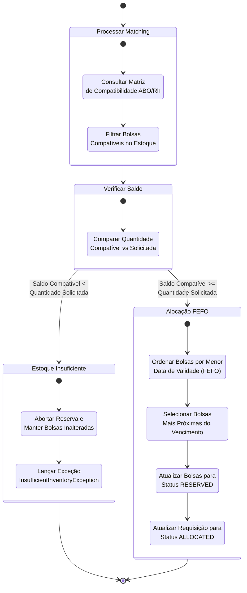

---

### POOUS07 — Integração com Módulo de Roteirização e Exibição de Rotas
* **Cenário Positivo:** Calcula rota ótima via Dijkstra e acopla a sequência de vértices e tempo estimado à alocação de transporte.
* **Cenário Negativo:** Hospital sem arestas conectadas no grafo dispara `InvalidRouteException` e reverte a alocação das bolsas.

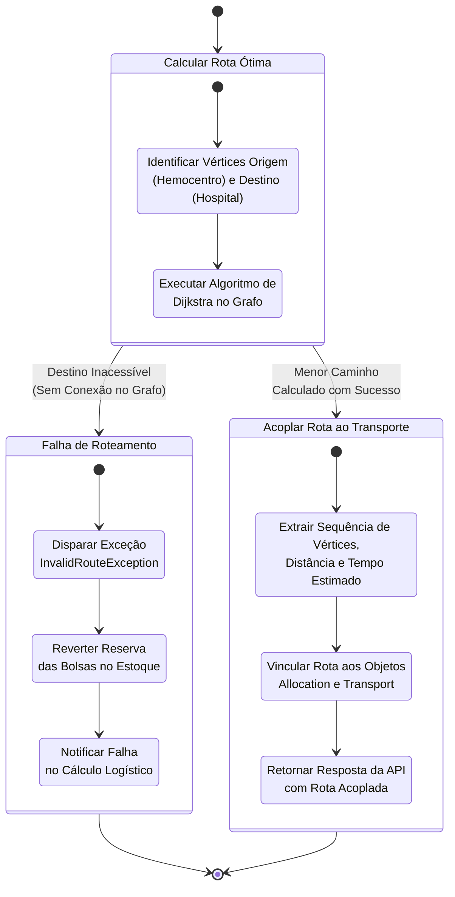

---

### POOUS08 — Integração dos Painéis de Monitoramento e Estatística
* **Cenário Positivo:** Endpoint `/dashboard/summary` agrega dados reais de estoque, distribuição estatística e telemetria da rede.
* **Cenário Negativo:** Banco recém-instanciado sem registros retorna estrutura com contadores zerados sem disparar `NullPointerException`.

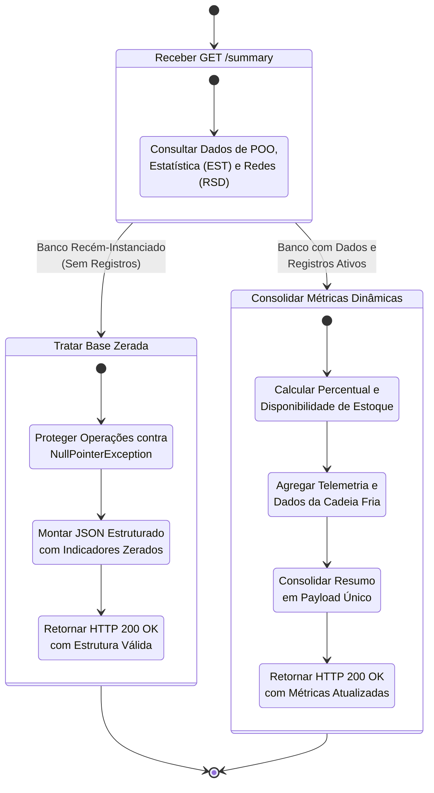

---

### POOUS09 — Início de Transporte e Monitoramento de Cadeia Fria
* **Cenário Positivo:** Alocação transiciona para `IN_TRANSIT`, gerando entidade `Transport` e ativando telemetria térmica.
* **Cenário Negativo:** Tentativa de iniciar transporte de requisição não alocada (`PENDING` ou `CANCELLED`) lança `IllegalStateException`.

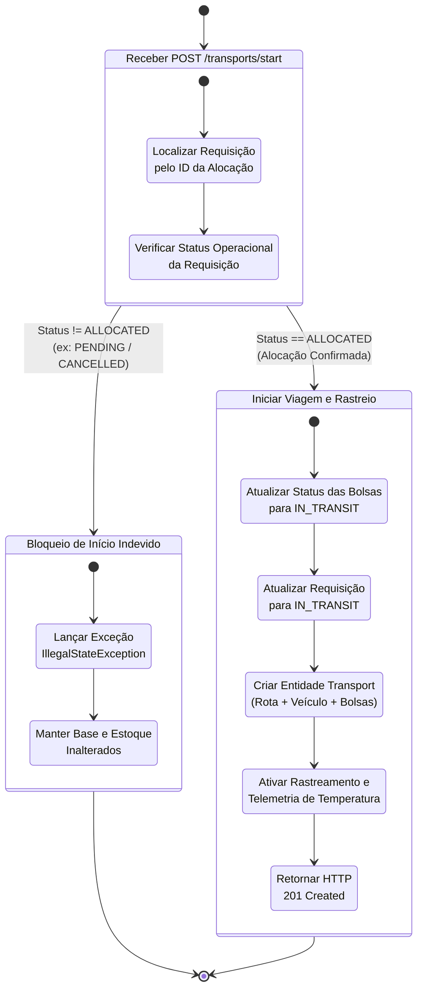

---

### POOUS10 — Cancelamento de Requisição com Liberação Automática de Estoque
* **Cenário Positivo:** Cancelamento de requisição `ALLOCATED` reverte as bolsas `RESERVED` para `AVAILABLE` no estoque e atualiza requisição para `CANCELLED`.
* **Cenário Negativo:** Tentativa de cancelar requisição com transporte já `IN_TRANSIT` é rejeitada com HTTP `422 Unprocessable Entity`.

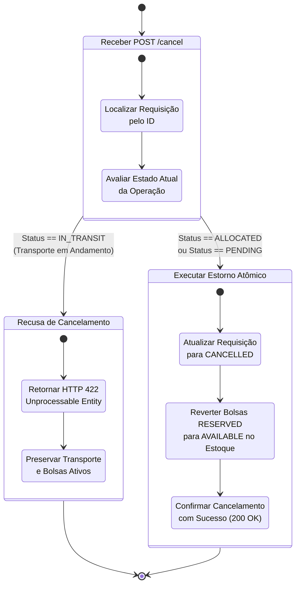

---

### POOUS11 — Confirmação do Recebimento e Baixa de Entrega
* **Cenário Positivo:** Confirmação de recebimento transiciona `Transport`, `Request` e bolsas para `DELIVERED`, gravando o timestamp final da operação.
* **Cenário Negativo:** Baixa em transporte com status divergente de `IN_TRANSIT` resulta em erro de regra de negócio.

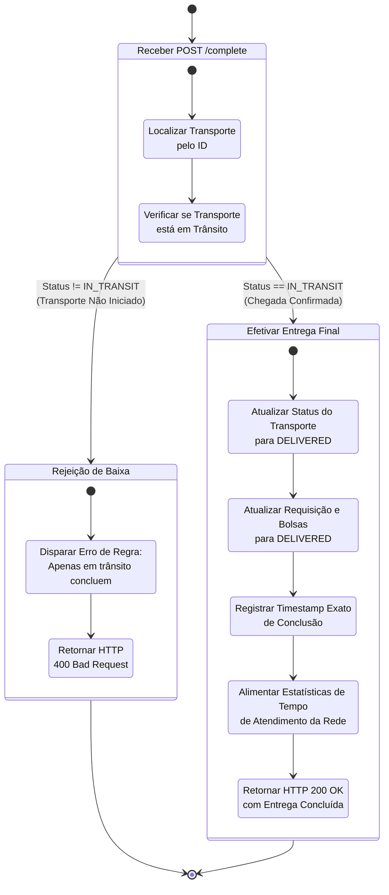

---

### POOUS12 — Bloqueio de Concorrência na Reserva Simultânea de Bolsas
* **Cenário Positivo:** Bloqueio pessimista (`@Lock(PESSIMISTIC_WRITE)`) garante que duas threads disputando a mesma bolsa serializem o acesso, reservando apenas para uma requisição.
* **Cenário Negativo:** Exceção durante a transação aciona rollback automático sem deixar bolsas bloqueadas em estado inconsistente.

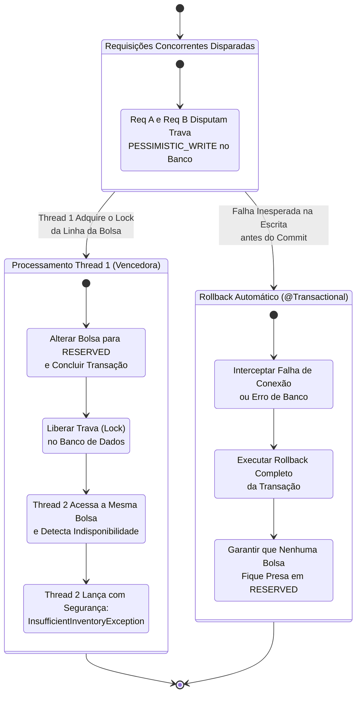

---

# 2. Algoritmos e Estruturas de Dados (AED)

## AED — Unidade 1: Estruturas de Dados Básicas de Domínio

---

### AEDUS01 — Fila de Processamento de Requisições Hospitalares
* **Cenário Positivo:** Inserção (`enqueue`) e remoção (`dequeue`) de requisições respeitam rigorosamente a ordem de chegada (FIFO).
* **Cenário Negativo:** Operação de `dequeue` em fila vazia lança `EmptyQueueException` sem corromper referências.

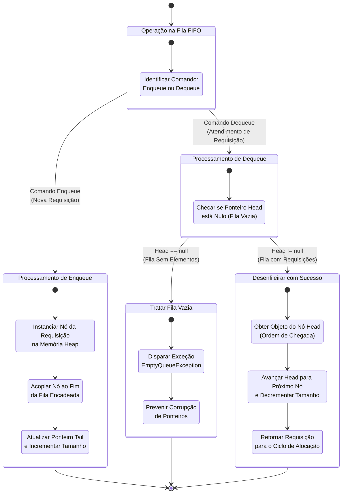

---

### AEDUS02 — Estrutura de Lista para Armazenamento Geral de Bolsas no Estoque
* **Cenário Positivo:** Inserção encadeada de bolsas em tempo dinâmico e busca sequencial por ID em complexidade linear $O(n)$.
* **Cenário Negativo:** Remoção de ID inexistente percorre toda a lista e retorna `false` sem quebrar os encadeamentos existentes.

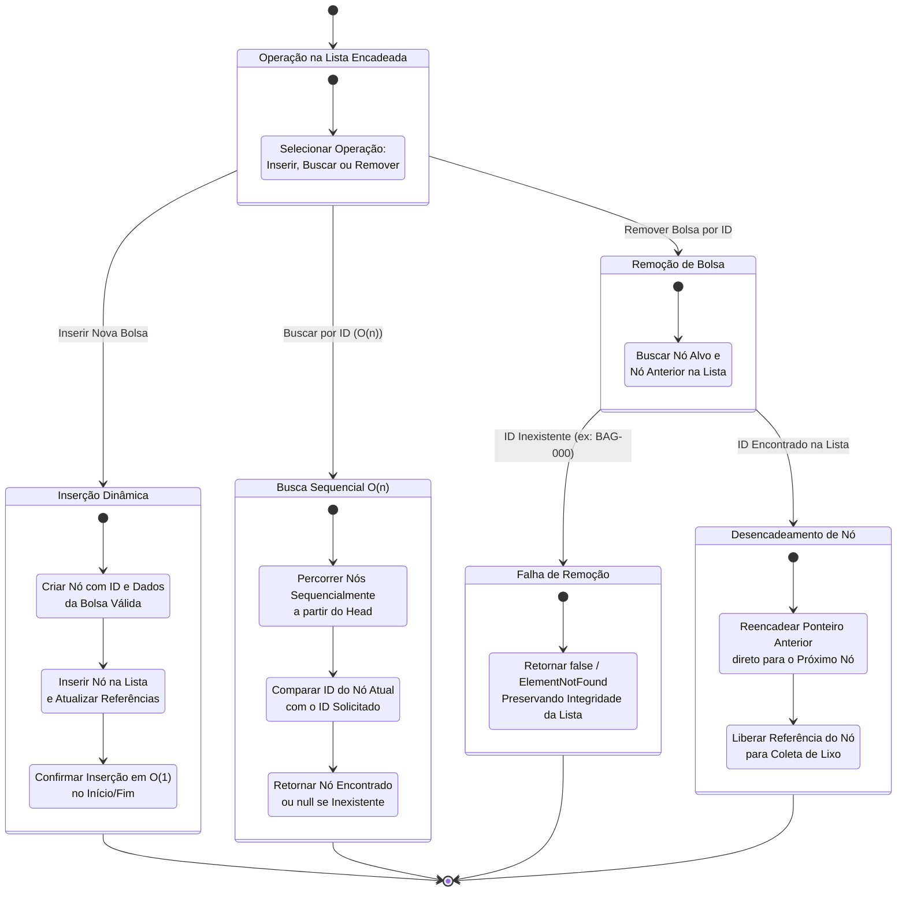

---

### AEDUS03 — Pilha de Histórico e Reversão de Operações de Estoque (Undo Log)
* **Cenário Positivo:** Empilhamento de transição de estado (`push`) e desempilhamento (`pop`) revertendo a bolsa ao status anterior.
* **Cenário Negativo:** Tentativa de executar `undo` com a pilha vazia lança `EmptyStackException`.

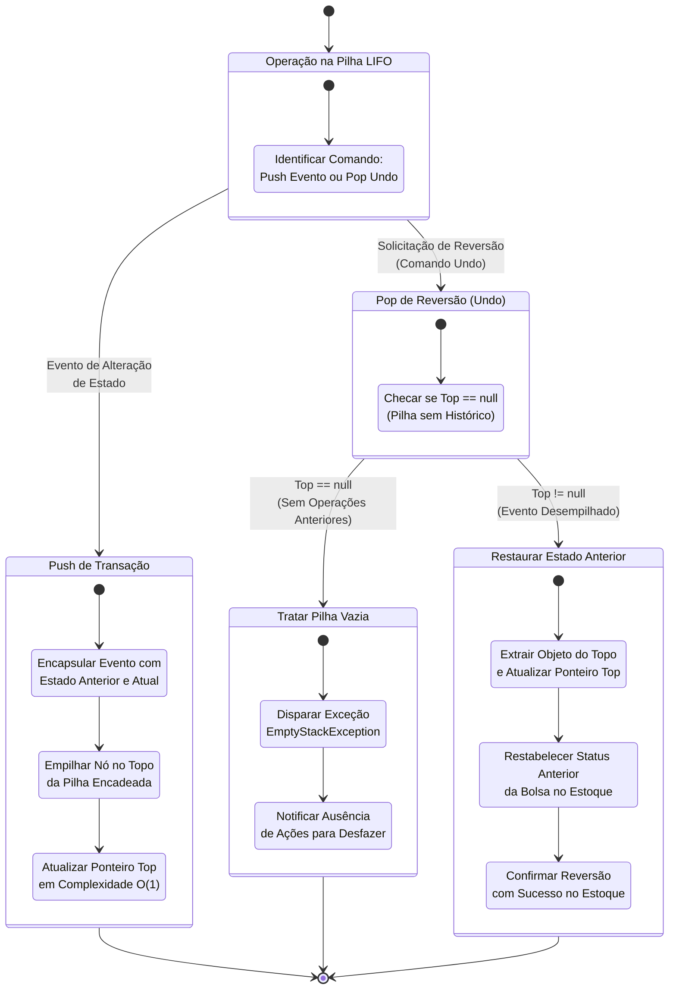

---

## AED — Unidade 2: Algoritmos Avançados e Otimização

---

### AEDUS04 — Roteirização e Caminho Mínimo por Grafo (Dijkstra)
* **Cenário Positivo:** Algoritmo de Dijkstra relaxa arestas ponderadas por tempo e encontra a rota de menor custo dentro da janela térmica.
* **Cenário Negativo:** Tempo acumulado excede a janela máxima da cadeia fria, sinalizando inviabilidade logística.

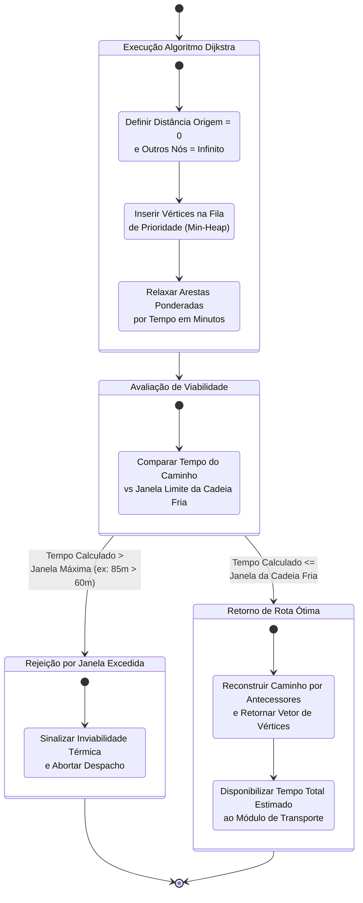

---

### AEDUS05 — Priorização de Validade por FEFO (Heap / Fila de Prioridade)
* **Cenário Positivo:** Fila de prioridade (Min-Heap) mantém a bolsa com data de validade mais próxima no topo ($O(1)$ para remoção).
* **Cenário Negativo:** Bolsas com validade expirada são descartadas antes da inserção na árvore de prioridades.

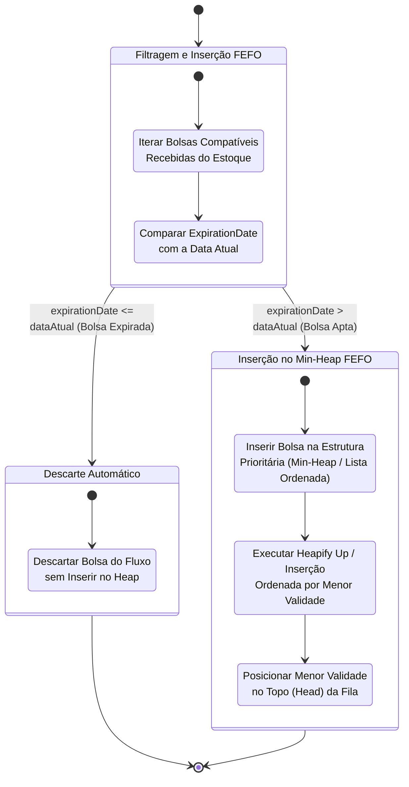

---

### AEDUS06 — Indexação de Estoque por Tabela Hash
* **Cenário Positivo:** Consulta direta à tabela hash pela chave composta `Tipo_Rh_Componente` retorna o bucket de bolsas em tempo médio $O(1)$.
* **Cenário Negativo:** Colisões de chave são resolvidas por encadeamento separado (*separate chaining*) mantendo a integridade.

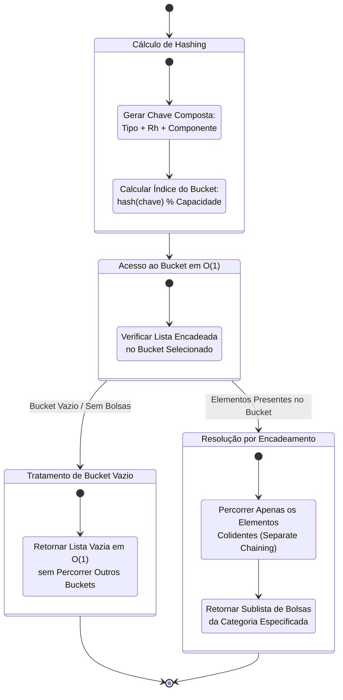

---

### AEDUS07 — Matriz de Compatibilidade Sanguínea ABO/Rh
* **Cenário Positivo:** Acesso à célula bidimensional `matrix[linhaReceptor][colunaDoador]` valida a transfusão em tempo estrito $O(1)$.
* **Cenário Negativo:** Cruzamento incompatível (ex: Receptor O- com Doador A+) retorna `false` e bloqueia a alocação.

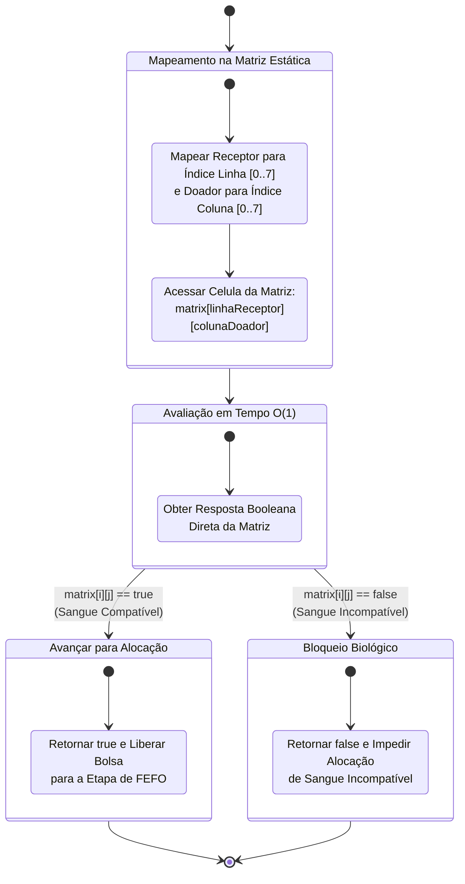

---

### AEDUS08 — Ordenação por MergeSort/QuickSort para Relatório de Validades
* **Cenário Positivo:** Algoritmo divide recursivamente o vetor de bolsas e realiza a intercalação ordenada em tempo assintótico $O(n \log n)$.
* **Cenário Negativo:** Conjunto com datas de validade repetidas preserva a ordem relativa original (estabilidade do MergeSort).

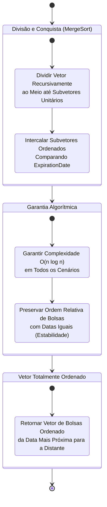

---

### AEDUS09 — Busca Binária em Vetor Estático de Hospitais Indexados
* **Cenário Positivo:** Divisão sucessiva do intervalo de busca reduz o espaço para localizar o hospital em tempo logarítmico $O(\log n)$.
* **Cenário Negativo:** ID inexistente esgota o intervalo (`inicio > fim`) e retorna `-1` ou dispara `EntityNotFoundException`.

```mermaid
stateDiagram-v2
    [*] --> IniciarBuscaBinaria

    state "Execução de Busca Binária" as IniciarBuscaBinaria {
        [*] --> DefinirLimites
        state "Definir Ponteiros: inicio = 0<br/>e fim = tamanho - 1" as DefinirLimites
        state "Calcular Meio: meio = (inicio + fim) / 2<br/>e Comparar hospitalId" as CompararMeio
        DefinirLimites --> CompararMeio
    }

    IniciarBuscaBinaria --> IDEncontrado : vetor[meio].id == targetId
    IniciarBuscaBinaria --> AjustarIntervalo : vetor[meio].id != targetId

    state "Ajuste de Intervalo O(log n)" as AjustarIntervalo {
        [*] --> AtualizarLimites
        state "Se target < meio: fim = meio - 1<br/>Se target > meio: inicio = meio + 1" as AtualizarLimites
    }

    AjustarIntervalo --> IniciarBuscaBinaria : inicio <= fim
    AjustarIntervalo --> NaoEncontrado : inicio > fim<br/>(Intervalo Esgotado)

    state "ID Localizado com Sucesso" as IDEncontrado {
        [*] --> RetornarHospital
        state "Retornar Dados da Entidade<br/>em no Máximo ~9 Comparações" as RetornarHospital
    }

    state "Tratar ID Inexistente" as NaoEncontrado {
        [*] --> DispararNotFound
        state "Retornar -1 ou Disparar<br/>EntityNotFoundException" as DispararNotFound
    }

    IDEncontrado --> [*]
    NaoEncontrado --> [*]
```

---

### AEDUS10 — Buffer Circular em Memória para Leitura de Telemetria
* **Cenário Positivo:** Ingestão contínua com ponteiros `head` e `tail` reaproveitando posições de memória via operação módulo (`tail = (tail + 1) % size`).
* **Cenário Negativo:** Buffer totalmente preenchido sem leitura ativa rejeita novas entradas evitando corrupção de memória.

```mermaid
stateDiagram-v2
    [*] --> ReceberTelemetriaBuffer

    state "Verificação de Capacidade" as ReceberTelemetriaBuffer {
        [*] --> ChecarOcupacao
        state "Verificar Contagem Atual<br/>vs Capacidade Fixa (ex: 100)" as ChecarOcupacao
    }

    ReceberTelemetriaBuffer --> BufferCheio : Contagem == Capacidade Máxima<br/>(100% Preenchido)
    ReceberTelemetriaBuffer --> InserirPacote : Contagem < Capacidade Máxima<br/>(Espaço Disponível)

    state "Tratamento de Buffer Cheio" as BufferCheio {
        [*] --> DispararOverflow
        state "Bloquear Inserção ou Disparar<br/>BufferOverflowException" as DispararOverflow
        state "Preservar Leituras Pendentes<br/>sem Corromper Ponteiros" as PreservarPendentes
        DispararOverflow --> PreservarPendentes
    }

    state "Gravação com Wrap-Around" as InserirPacote {
        [*] --> GravarNoIndiceTail
        state "Gravar Pacote na Posição<br/>array[tail]" as GravarNoIndiceTail
        state "Avançar Ponteiro Circular:<br/>tail = (tail + 1) % Capacidade" as AvancarTail
        state "Consumidor Lê Head:<br/>head = (head + 1) % Capacidade" as LerHead
        GravarNoIndiceTail --> AvancarTail
        AvancarTail --> LerHead
    }

    BufferCheio --> [*]
    InserirPacote --> [*]
```

---

# 3. Estatística e Probabilidade (EST)

## EST — Unidade 1: Análise Descritiva e Painel Inicial

---

### ESTUS01 — Análise Descritiva do Estoque por Tipo Sanguíneo e Componente
* **Cenário Positivo:** Totalização e cálculo percentual relativo de cada tipo/componente no estoque ativo.
* **Cenário Negativo:** Estoque vazio totaliza zero sem gerar divisão por zero (`ArithmeticException`).

```mermaid
stateDiagram-v2
    [*] --> RequisitarAnaliseEstoque

    state "Cálculo de Proporções" as RequisitarAnaliseEstoque {
        [*] --> TotalizarEntradas
        state "Totalizar Quantidade Total<br/>de Bolsas no Banco" as TotalizarEntradas
        state "Agrupar por Tipo Sanguíneo<br/>e Componente" as AgruparTipos
        TotalizarEntradas --> AgruparTipos
    }

    RequisitarAnaliseEstoque --> EstoqueVazio : Total de Bolsas == 0
    RequisitarAnaliseEstoque --> CalcularFrequencias : Total de Bolsas > 0

    state "Tratar Divisão por Zero" as EstoqueVazio {
        [*] --> EvitarArithmeticException
        state "Prevenir Divisão por Zero<br/>(ArithmeticException)" as EvitarArithmeticException
        state "Retornar JSON Válido<br/>com Frequências 0.0%" as RetornarZeroJson
        EvitarArithmeticException --> RetornarZeroJson
    }

    state "Consolidar Estatística Descritiva" as CalcularFrequencias {
        [*] --> CalcularPercentuais
        state "Calcular Proporção Relativa (%)<br/>de Cada Categoria" as CalcularPercentuais
        state "Consolidar Totais por Tipo<br/>(ex: 40% O+, 10% AB-)" as ConsolidarTotais
        CalcularPercentuais --> ConsolidarTotais
    }

    EstoqueVazio --> [*]
    CalcularFrequencias --> [*]
```

---

### ESTUS02 — Métricas de Tendência Central e Dispersão para Demanda
* **Cenário Positivo:** Cálculo automatizado de média, mediana, variância e desvio padrão das solicitações por hospital.
* **Cenário Negativo:** Amostra com apenas uma requisição ($n=1$) trata $n-1=0$, definindo desvio padrão igual a zero com aviso.

```mermaid
stateDiagram-v2
    [*] --> ObterHistoricoDemanda

    state "Verificação Amostral" as ObterHistoricoDemanda {
        [*] --> ContarAmostras
        state "Contar Número de Requisições (n)<br/>no Período Selecionado" as ContarAmostras
    }

    ObterHistoricoDemanda --> AmostraUnitaria : n <= 1<br/>(Amostra Insuficiente)
    ObterHistoricoDemanda --> CalcularEstatisticas : n >= 2<br/>(Amostra Válida)

    state "Tratamento de Amostra Unitária" as AmostraUnitaria {
        [*] --> DefinirGrausLiberdade
        state "Tratar Denominador n - 1 = 0<br/>Definindo Desvio Padrão = 0" as DefinirGrausLiberdade
        state "Notificar Alerta:<br/>Amostra Insuficiente para Dispersão" as NotificarAmostra
        DefinirGrausLiberdade --> NotificarAmostra
    }

    state "Cálculo de Média, Mediana e Desvio" as CalcularEstatisticas {
        [*] --> CalcularMediaMediana
        state "Calcular Média Aritmética<br/>e Mediana dos Volumes" as CalcularMediaMediana
        state "Calcular Variância e Desvio Padrão<br/>Populacional / Amostral" as CalcularDesvio
        state "Retornar Relatório Estatístico<br/>Consolidado (ex: Média=20, DP=8.16)" as RetornarRelatorio
        CalcularMediaMediana --> CalcularDesvio
        CalcularDesvio --> RetornarRelatorio
    }

    AmostraUnitaria --> [*]
    CalcularEstatisticas --> [*]
```

---

### ESTUS03 — Análise de Tempos de Atendimento e Entrega Logística
* **Cenário Positivo:** Extração de deltas de tempo (emissão até entrega) calculando mínimo, máximo, média e desvio padrão.
* **Cenário Negativo:** Registros com timestamp de término nulo são descartados sem afetar o cálculo das entregas concluídas.

```mermaid
stateDiagram-v2
    [*] --> CarregarEntregasFinalizadas

    state "Filtragem de Dados Válidos" as CarregarEntregasFinalizadas {
        [*] --> FiltrarRegistros
        state "Percorrer Entregas e Identificar<br/>Timestamps Nulos ou Corrompidos" as FiltrarRegistros
    }

    CarregarEntregasFinalizadas --> IgnorarRegistrosNulos : Registros com Datas Ausentes
    CarregarEntregasFinalizadas --> ProcessarMetricasTempo : Registros Válidos com Início/Fim

    state "Tratamento de Dados Incompletos" as IgnorarRegistrosNulos {
        [*] --> DescartarNulos
        state "Descartar Linhas Incompletas<br/>sem Afetar o Cálculo Geral" as DescartarNulos
    }

    state "Cálculo de Tempos Operacionais" as ProcessarMetricasTempo {
        [*] --> ExtrairIntervalos
        state "Calcular Delta de Tempo<br/>(Fim - Início) em Minutos" as ExtrairIntervalos
        state "Identificar Tempo Mínimo, Máximo,<br/>Médio e Desvio Padrão" as ConsolidarMetricas
        state "Exibir Indicadores no Painel<br/>(ex: Mín=20m, Máx=40m, Média=30m)" as RenderizarMetricas
        ExtrairIntervalos --> ConsolidarMetricas
        ConsolidarMetricas --> RenderizarMetricas
    }

    IgnorarRegistrosNulos --> ProcessarMetricasTempo
    ProcessarMetricasTempo --> [*]
```

---

## EST — Unidade 2: Análise Probabilística e Modelagem

---

### ESTUS04 — Análise Probabilística de Desabastecimento por Tipo Sanguíneo
* **Cenário Positivo:** Aplicação da distribuição de Poisson $P(Demanda > Estoque)$ alerta criticidade caso a probabilidade de ruptura supere 80%.
* **Cenário Negativo:** Estoque abundante com taxa de solicitação baixa calcula risco nulo e sinaliza estabilidade.

```mermaid
stateDiagram-v2
    [*] --> IniciarCalculoRisco

    state "Modelagem Probabilística" as IniciarCalculoRisco {
        [*] --> CruzarTaxaDemanda
        state "Obter Demanda Média Diária (λ)<br/>e Saldo Atual de Estoque (k)" as CruzarTaxaDemanda
        state "Calcular Probabilidade de Poisson:<br/>P(Demanda > Estoque)" as CalcularPoisson
        CruzarTaxaDemanda --> CalcularPoisson
    }

    IniciarCalculoRisco --> AlertaCriticoFalta : P(Demanda > Estoque) > 80%<br/>(Estoque Crítico)
    IniciarCalculoRisco --> AbastecimentoSeguro : P(Demanda > Estoque) ≈ 0%<br/>(Estoque Abundante)

    state "Emissão de Alerta Crítico" as AlertaCriticoFalta {
        [*] --> DispararAlertaPainel
        state "Sinalizar Risco Alto (>80%)<br/>para o Tipo Sanguíneo no Painel" as DispararAlertaPainel
        state "Recomendar Abertura Imediata<br/>de Campanha de Captação" as RecomendarCampanha
        DispararAlertaPainel --> RecomendarCampanha
    }

    state "Status de Abastecimento Seguro" as AbastecimentoSeguro {
        [*] --> RegistrarStatusSeguro
        state "Indicar Probabilidade Nula de Falta<br/>e Status Operacional Estável" as RegistrarStatusSeguro
    }

    AlertaCriticoFalta --> [*]
    AbastecimentoSeguro --> [*]
```

---

### ESTUS05 — Cálculo da Taxa de Descarte por Vencimento de Validade
* **Cenário Positivo:** Razão percentual $(Vencidas / Entradas) \times 100$ reflete a eficiência do método FEFO.
* **Cenário Negativo:** Período sem bolsas descartadas registra taxa 0.0% sem inconsistências.

```mermaid
stateDiagram-v2
    [*] --> IniciarCalculoDescarte

    state "Contabilização do Período" as IniciarCalculoDescarte {
        [*] --> ContarBolsasPeriodo
        state "Contar Total de Entradas (E)<br/>e Total de Bolsas Vencidas (V)" as ContarBolsasPeriodo
    }

    IniciarCalculoDescarte --> SemDescartes : V == 0 (0 Vencimentos)
    IniciarCalculoDescarte --> CalcularTaxaPercentual : V > 0 (Houve Descartes)

    state "Eficiência Máxima (0%)" as SemDescartes {
        [*] --> RetornarZeroPorcento
        state "Registrar Taxa de Descarte = 0.0%<br/>Atestando Eficiência Máxima FEFO" as RetornarZeroPorcento
    }

    state "Cálculo da Taxa de Perda" as CalcularTaxaPercentual {
        [*] --> AplicarFormula
        state "Aplicar Fórmula de Perda:<br/>Taxa = (V / E) * 100" as AplicarFormula
        state "Exibir Taxa Percentual no Relatório<br/>(ex: 10 vencidas em 200 = 5.0%)" as ExibirRelatorio
        AplicarFormula --> ExibirRelatorio
    }

    SemDescartes --> [*]
    CalcularTaxaPercentual --> [*]
```

---

### ESTUS06 — Previsão Simples de Demanda por Média Móvel / Regressão
* **Cenário Positivo:** Projeção por Média Móvel dos últimos períodos estima o consumo de bolsas para o próximo dia.
* **Cenário Negativo:** Histórico com menos de dois dias de registros emite aviso de dados insuficientes.

```mermaid
stateDiagram-v2
    [*] --> AvaliarHistoricoConsumo

    state "Checagem de Dados Históricos" as AvaliarHistoricoConsumo {
        [*] --> ContarDiasHistorico
        state "Verificar Dias Consecutivos<br/>Registrados no Banco" as ContarDiasHistorico
    }

    AvaliarHistoricoConsumo --> DadosInsuficientes : Histórico < 2 Dias
    AvaliarHistoricoConsumo --> ProjetarDemanda : Histórico >= 3 Dias

    state "Tratamento de Dados Insuficientes" as DadosInsuficientes {
        [*] --> BloquearProjecao
        state "Emitir Alerta: Dados Insuficientes<br/>para Projeção Confiável" as BloquearProjecao
    }

    state "Cálculo de Tendência Futura" as ProjetarDemanda {
        [*] --> AplicarMediaMovel
        state "Calcular Média Móvel / Regressão<br/>Linear dos Últimos Dias" as AplicarMediaMovel
        state "Projetar Demanda Estimada<br/>para o Próximo Dia (ex: 12 bolsas)" as ExibirProjecao
        AplicarMediaMovel --> ExibirProjecao
    }

    DadosInsuficientes --> [*]
    ProjetarDemanda --> [*]
```

---

### ESTUS07 — Painel Consolidado de Indicadores e Integração REST
* **Cenário Positivo:** Requisição GET unifica os indicadores estatísticos retornando payload JSON completo com HTTP 200 OK.
* **Cenário Negativo:** Indisponibilidade de tabelas de histórico responde com dados em cache ou HTTP 503 Service Unavailable estruturado.

```mermaid
stateDiagram-v2
    [*] --> ReceberGetSummaryREST

    state "Agregação de Indicadores" as ReceberGetSummaryREST {
        [*] --> ConsultarModulosEstatisticos
        state "Chamar Cálculos de Estoque, Descarte,<br/>Probabilidade e Demanda" as ConsultarModulosEstatisticos
    }

    ReceberGetSummaryREST --> FalhaBancoHistórico : Tabela Indisponível / Timeout
    ReceberGetSummaryREST --> ConsolidarPayloadSucesso : Serviços Estatísticos Operacionais

    state "Tratamento de Falha Temporária" as FalhaBancoHistórico {
        [*] --> RecuperarCacheOu503
        state "Utilizar Dados do Último Cache Válido<br/>ou Retornar HTTP 503 Estruturado" as RecuperarCacheOu503
    }

    state "Montagem do Payload JSON" as ConsolidarPayloadSucesso {
        [*] --> GerarNosJSON
        state "Montar Estrutura JSON com Nós:<br/>tendencia, dispersao, risco, descarte" as GerarNosJSON
        state "Retornar HTTP 200 OK<br/>com Payload Consolidado" as Retornar200OK
        GerarNosJSON --> Retornar200OK
    }

    FalhaBancoHistórico --> [*]
    ConsolidarPayloadSucesso --> [*]
```

---

# 4. Infraestrutura de Software (SO)

## SO — Unidade 1: CI/CD, Deploy Inicial e Concorrência

---

### SOUS01 — Esteira de Integração e Entrega Contínua (Pipeline CI/CD)
* **Cenário Positivo:** Push dispara GitHub Actions, compila o código Java, passa nos testes e gera o artefato JAR.
* **Cenário Negativo:** Quebra de teste unitário aborta o pipeline e notifica a equipe com relatório do erro.

```mermaid
stateDiagram-v2
    [*] --> PushEngatilhado

    state "Execução GitHub Actions" as PushEngatilhado {
        [*] --> CheckoutEJavaSetup
        state "Checkout do Repositório<br/>e Setup do JDK 17+" as CheckoutEJavaSetup
        state "Executar Compilação Maven/Gradle<br/>e Testes Automatizados" as ExecutarTestes
        CheckoutEJavaSetup --> ExecutarTestes
    }

    PushEngatilhado --> PipelineQuebrado : Falha em Teste Unitário<br/>ou Erro de Compilação
    PushEngatilhado --> GerarArtefatoDeploy : Todos os Testes Aprovados

    state "Falha e Notificação" as PipelineQuebrado {
        [*] --> InterromperEsteira
        state "Interromper Pipeline Imediatamente<br/>e Bloquear Etapa de Deploy" as InterromperEsteira
        state "Notificar Equipe no GitHub<br/>com Log de Erro" as NotificarEquipe
        InterromperEsteira --> NotificarEquipe
    }

    state "Empacotamento com Sucesso" as GerarArtefatoDeploy {
        [*] --> GerarJAR
        state "Empacotar Artefato Executável JAR<br/>e Preparar para Entrega Contínua" as GerarJAR
    }

    PipelineQuebrado --> [*]
    GerarArtefatoDeploy --> [*]
```

---

### SOUS02 — Deploy Contínuo e Publicação da Aplicação em Nuvem
* **Cenário Positivo:** Implantação em PaaS/Cloud validada com resposta 200 OK no endpoint `/actuator/health`.
* **Cenário Negativo:** Falha de conexão de banco aborta a nova versão e mantém a release estável anterior em execução.

```mermaid
stateDiagram-v2
    [*] --> IniciarDeployCloud

    state "Provisionamento em Nuvem" as IniciarDeployCloud {
        [*] --> EnviarContêiner
        state "Subir Imagem Docker / Pacote JAR<br/>no Provedor PaaS/Cloud" as EnviarContêiner
        state "Executar Health Check:<br/>GET /actuator/health" as ExecutarHealthCheck
        EnviarContêiner --> ExecutarHealthCheck
    }

    IniciarDeployCloud --> FalhaVariaveisOuBanco : Erro de Configuração<br/>(URL de BD Inválida)
    IniciarDeployCloud --> DeployAtivoSucesso : Resposta HTTP 200 OK<br/>na Rota de Saúde

    state "Abortar Implantação" as FalhaVariaveisOuBanco {
        [*] --> CancelarSubida
        state "Contêiner Falha ao Conectar no BD<br/>e Aborta Nova Implantação" as CancelarSubida
        state "Preservar Versão Anterior no Ar<br/>sem Indisponibilidade" as ManterVersaoAntiga
        CancelarSubida --> ManterVersaoAntiga
    }

    state "Versão em Produção" as DeployAtivoSucesso {
        [*] --> RotaPublicaAtiva
        state "Liberar Tráfego para Nova Versão<br/>com PostgreSQL Conectado" as RotaPublicaAtiva
    }

    FalhaVariaveisOuBanco --> [*]
    DeployAtivoSucesso --> [*]
```

---

### SOUS03 — Processamento Concorrente Multi-Thread para Telemetria
* **Cenário Positivo:** Ingestão de pacotes simultâneos é delegada para pool de threads assíncronas (`@Async`/`ExecutorService`) respondendo 202 Accepted.
* **Cenário Negativo:** Saturação de threads aplica política de descarte/rejeição controlada sem travar o servidor principal.

```mermaid
stateDiagram-v2
    [*] --> RajadaTelemetriaRecebida

    state "Ingestão no Pool Concorrente" as RajadaTelemetriaRecebida {
        [*] --> AlocarNoThreadPool
        state "Receber Pacotes Simultâneos<br/>e Delegar ao ExecutorService" as AlocarNoThreadPool
    }

    RajadaTelemetriaRecebida --> FilaDeTrabalhoCheia : Fila Saturada sob Carga Extrema
    RajadaTelemetriaRecebida --> IngestaoParalelaSucesso : Threads Disponíveis no Pool

    state "Política de Rejeição / Sobrecarga" as FilaDeTrabalhoCheia {
        [*] --> AplicarCallerRuns
        state "Aplicar CallerRunsPolicy / Erro 429<br/>sem Congelar a Thread Tomcat" as AplicarCallerRuns
    }

    state "Processamento Assíncrono" as IngestaoParalelaSucesso {
        [*] --> ProcessarThreadsParalelas
        state "Executar Ingestão de GPS/Temperatura<br/>em Múltiplas Threads em Paralelo" as ProcessarThreadsParalelas
        state "Retornar HTTP 202 Accepted<br/>Instantaneamente ao Veículo" as Retornar202
        ProcessarThreadsParalelas --> Retornar202
    }

    FilaDeTrabalhoCheia --> [*]
    IngestaoParalelaSucesso --> [*]
```

---

## SO — Unidade 2: Arquitetura, Cenários e Sincronização

---

### SOUS04 — Sincronização e Prevenção de Condições de Corrida
* **Cenário Positivo:** Seção crítica com sincronização atômica (`ReentrantLock`) impede reservas simultâneas da mesma bolsa.
* **Cenário Negativo:** Threads concorrentes que chegam após o lock encontram a bolsa em estado `RESERVED` e recusam com segurança.

```mermaid
stateDiagram-v2
    [*] --> DisputaConcorrenteThreads

    state "Disputa de Trava Atômica" as DisputaConcorrenteThreads {
        [*] --> DisputarReentrantLock
        state "Múltiplas Threads Disputam Lock<br/>sobre o Recurso da Mesma Bolsa" as DisputarReentrantLock
    }

    DisputaConcorrenteThreads --> ThreadObtemLock : Trava Adquirida com Sucesso
    DisputaConcorrenteThreads --> ThreadBloqueada : Recurso Já em Uso por Outra Thread

    state "Execução em Seção Crítica" as ThreadObtemLock {
        [*] --> ExecutarMudancaEstado
        state "Alterar Status da Bolsa de Forma Atômica<br/>(AVAILABLE -> RESERVED)" as ExecutarMudancaEstado
        state "Liberar Trava (Lock) no Bloco Finally" as LiberarTrava
        ExecutarMudancaEstado --> LiberarTrava
    }

    state "Bloqueio e Validação de Estado" as ThreadBloqueada {
        [*] --> AguardarLiberacao
        state "Aguardar Liberação da Trava<br/>e Reavaliar Status da Bolsa" as AguardarLiberacao
        state "Detectar que Bolsa Não Está Mais AVAILABLE<br/>e Recusar Reserva com Segurança" as RecusarReserva
        AguardarLiberacao --> RecusarReserva
    }

    ThreadObtemLock --> [*]
    ThreadBloqueada --> [*]
```

---

### SOUS05 — Dimensionamento e Modelagem para Três Cenários de Carga
* **Cenário Positivo:** Dimensionamento de recursos (CPU, RAM, réplicas e banco) categorizado para Baixo, Moderado e Alto uso (10k req/min).
* **Cenário Negativo:** Cenário de baixo tráfego evita provisionamento superdimensionado (*over-engineering*).

```mermaid
stateDiagram-v2
    [*] --> AvaliarCenarioCarga

    state "Mapeamento de Demanda" as AvaliarCenarioCarga {
        [*] --> ClassificarVolume
        state "Identificar Perfil:<br/>Baixo, Moderado ou Alto (Emergência)" as ClassificarVolume
    }

    AvaliarCenarioCarga --> CenarioBaixo : Operação Local / Unidade Isolada
    AvaliarCenarioCarga --> CenarioModerado : Hemocentro Regional com Hospitais
    AvaliarCenarioCarga --> CenarioAlto : Rede Estadual sob Pico (10k req/min)

    state "Dimensionamento Baixo" as CenarioBaixo {
        [*] --> DimensionarMinimo
        state "Provisionar Recursos Mínimos Proporcionais<br/>Evitando Superdimensionamento (Over-engineering)" as DimensionarMinimo
    }

    state "Dimensionamento Moderado" as CenarioModerado {
        [*] --> DimensionarRegional
        state "Provisionar Instância Padrão de Aplicação<br/>com Banco Gerenciado e Cache" as DimensionarRegional
    }

    state "Dimensionamento Alto (Alta Disponibilidade)" as CenarioAlto {
        [*] --> DimensionarAltaCarga
        state "Adotar Load Balancer, Múltiplas Réplicas,<br/>Auto-Scaling e Réplicas de Leitura no BD" as DimensionarAltaCarga
        state "Garantir Zero Single Point of Failure (SPOF)" as GarantirZeroSPOF
        DimensionarAltaCarga --> GarantirZeroSPOF
    }

    CenarioBaixo --> [*]
    CenarioModerado --> [*]
    CenarioAlto --> [*]
```

---

### SOUS06 — Estimativa e Planilha de Orçamento da Infraestrutura em Nuvem
* **Cenário Positivo:** Levantamento de custos de instâncias, banco e tráfego com justificativa técnica e financeira para os 3 cenários.
* **Cenário Negativo:** Identificação de custos excessivos sugere instâncias reservadas ou serverless reduzindo custos em até 40%.

```mermaid
stateDiagram-v2
    [*] --> IniciarLevantamentoCustos

    state "Cálculo por Componente" as IniciarLevantamentoCustos {
        [*] --> PrecificarRecursos
        state "Quantificar Custos de vCPU/RAM,<br/>Banco Gerenciado, Armazenamento e Tráfego" as PrecificarRecursos
    }

    IniciarLevantamentoCustos --> IdentificarExtrapolacao : Precificação 100% On-Demand<br/>(Custo Excessivo)
    IniciarLevantamentoCustos --> ConsolidarOrcamento : Estratégia Híbrida / Instâncias Reservadas

    state "Otimização de Custos" as IdentificarExtrapolacao {
        [*] --> RecomendarReservas
        state "Identificar Alto Custo sob Demanda e Sugerir<br/>Instâncias Reservadas / Serverless (-40% Custo)" as RecomendarReservas
    }

    state "Planilha Consolidada" as ConsolidarOrcamento {
        [*] --> TotalizarPlanilha
        state "Gerar Planilha Discriminada Mensal e Anual<br/>para os 3 Cenários Simulados" as TotalizarPlanilha
    }

    IdentificarExtrapolacao --> ConsolidarOrcamento
    ConsolidarOrcamento --> [*]
```

---

### SOUS07 — Rollback Automatizado no Pipeline de Deploy
* **Cenário Positivo:** Falha no Health Check pós-deploy aciona reversão automática de tráfego para a versão anterior estável sem indisponibilidade.
* **Cenário Negativo:** Instalação saudável desativa contêineres antigos consolidando a nova release.

```mermaid
stateDiagram-v2
    [*] --> MonitorarDeployRecente

    state "Validação Pós-Deploy" as MonitorarDeployRecente {
        [*] --> ChecarHealthStatus
        state "Executar Bateria de Health Checks<br/>na Nova Versão Implantada" as ChecarHealthStatus
    }

    MonitorarDeployRecente --> FalhaHealthCheck : Erro Consecutivo de Inicialização
    MonitorarDeployRecente --> DeployEstavel : Health Check Aprovado (200 OK)

    state "Rollback Automatizado" as FalhaHealthCheck {
        [*] --> ReverterTrafego
        state "Interromper Tráfego da Nova Versão<br/>e Restaurar Imagem Estável Anterior" as ReverterTrafego
        state "Notificar Equipe de Engenharia<br/>sobre Incidente e Rollback Acionado" as NotificarIncidente
        state "Garantir Atendimento Normal aos Hospitais<br/>sem Queda de Serviço" as ManterAtendimento
        ReverterTrafego --> NotificarIncidente
        NotificarIncidente --> ManterAtendimento
    }

    state "Ambiente Estabilizado" as DeployEstavel {
        [*] --> ConfirmarProducao
        state "Confirmar Estabilidade da Nova Release<br/>em Produção" as ConfirmarProducao
    }

    FalhaHealthCheck --> [*]
    DeployEstavel --> [*]
```

---

# 5. Infraestrutura de Comunicação / Redes (RSD)

## RSD — Unidade 1: Topologia, Requisitos e Protocolos

---

### RSDUS01 — Projeto da Topologia de Rede da Hemorrede
* **Cenário Positivo:** Topologia conectando nós fixos (VPN/HTTPS) e móveis (4G/5G/Broker) com links de redundância e sem SPOF (*Single Point of Failure*).
* **Cenário Negativo:** Proposta sem redundância no enlace central é reprovada exigindo rota de failover.

```mermaid
stateDiagram-v2
    [*] --> AnalisarTopologiaProposta

    state "Mapeamento OSI / TCP-IP" as AnalisarTopologiaProposta {
        [*] --> MapearEnlaces
        state "Definir Enlaces Fixos (VPN/HTTPS)<br/>e Enlaces Móveis (4G/5G/Broker)" as MapearEnlaces
        state "Verificar Pontos de Borda e Roteamento" as ChecarPontosBorda
        MapearEnlaces --> ChecarPontosBorda
    }

    AnalisarTopologiaProposta --> PontoUnicoFalha : Hemocentro sem Link de Redundância<br/>(Single Point of Failure)
    AnalisarTopologiaProposta --> TopologiaAprovada : Arquitetura Resiliente com Failover

    state "Rejeição e Ajuste de Topologia" as PontoUnicoFalha {
        [*] --> ReprovarEExigirRedundancia
        state "Reprovar Proposta e Adicionar Link Secundário<br/>com Failover Automático" as ReprovarEExigirRedundancia
    }

    state "Topologia Homologada" as TopologiaAprovada {
        [*] --> DocumentarEndpoints
        state "Documentar Endpoints, Protocolos e Enlaces<br/>de Todas as Unidades Fixas e Móveis" as DocumentarEndpoints
    }

    PontoUnicoFalha --> [*]
    TopologiaAprovada --> [*]
```

---

### RSDUS02 — Mapeamento de Requisitos de Negócio em Requisitos Técnicos
* **Cenário Positivo:** Tradução das demandas operacionais (telemetria contínua, criticidade) em especificações de vazão, latência e criptografia TLS.
* **Cenário Negativo:** Ausência de requisitos para cenários rurais sinaliza pendência antes do desenho da rede.

```mermaid
stateDiagram-v2
    [*] --> ReceberDemandasDominio

    state "Tradução de Requisitos" as ReceberDemandasDominio {
        [*] --> MapearNecessidade
        state "Mapear Necessidade de Negócio<br/>(ex: Telemetria Contínua da Cadeia Fria)" as MapearNecessidade
        state "Especificar Métrica Técnica:<br/>Latência Máxima, Vazão e Criptografia" as EspecificarMetrica
        MapearNecessidade --> EspecificarMetrica
    }

    ReceberDemandasDominio --> LacunaTecnicaIdentificada : Cenário sem Requisito Técnico<br/>(ex: Área Rural sem 4G Estável)
    ReceberDemandasDominio --> MapeamentoConcluido : Requisitos Técnicos Mapeados

    state "Sinalização de Pendência" as LacunaTecnicaIdentificada {
        [*] --> BloquearAvancoTopologia
        state "Identificar Lacuna e Bloquear Avanço<br/>até Definição Técnica Adequada" as BloquearAvancoTopologia
    }

    state "Matriz de Requisitos Aprovada" as MapeamentoConcluido {
        [*] --> EntregarEspecificacaoTecnica
        state "Publicar Matriz de Requisitos de Rede<br/>para Suporte à Topologia e Protocolos" as EntregarEspecificacaoTecnica
    }

    LacunaTecnicaIdentificada --> [*]
    MapeamentoConcluido --> [*]
```

---

### RSDUS03 — Especificação dos Protocolos e Contratos de Telemetria
* **Cenário Positivo:** Formato REST/JSON bem estruturado com latitude, longitude, temperatura e timestamp é aceito e responde 202 Accepted.
* **Cenário Negativo:** Payload corrompido ou com tipos incorretos é rejeitado na camada de transporte com HTTP 400 Bad Request.

```mermaid
stateDiagram-v2
    [*] --> ReceberPacoteTelemetria

    state "Validação de Contrato de API" as ReceberPacoteTelemetria {
        [*] --> ValidarHeadersEJSON
        state "Validar Cabeçalhos HTTP/MQTT<br/>e Esquema do Payload JSON" as ValidarHeadersEJSON
        state "Checar Campos: transportId, lat, long,<br/>temperatura (°C) e timestamp" as ChecarCamposJSON
        ValidarHeadersEJSON --> ChecarCamposJSON
    }

    ReceberPacoteTelemetria --> PayloadMalformatado : Campos Obrigatórios Ausentes<br/>ou Tipos Incompatíveis
    ReceberPacoteTelemetria --> ContratoValido : Payload JSON em Conformidade

    state "Rejeição de Contrato" as PayloadMalformatado {
        [*] --> Retornar400BadPayload
        state "Rejeitar Requisição no Gateway<br/>e Retornar HTTP 400 Bad Request" as Retornar400BadPayload
    }

    state "Ingestão Aceita" as ContratoValido {
        [*] --> DecodificarPayload
        state "Decodificar Dados e Repassar<br/>para a Camada de Aplicação" as DecodificarPayload
        state "Responder HTTP 202 Accepted<br/>ao Emulador do Veículo" as Retornar202Accepted
        DecodificarPayload --> Retornar202Accepted
    }

    PayloadMalformatado --> [*]
    ContratoValido --> [*]
```

---

## RSD — Unidade 2: Benchmarking, Painel de Rede e Implantação

---

### RSDUS04 — Benchmarking de Métricas de Rede (Latência, Vazão e Perda)
* **Cenário Positivo:** Teste de estresse com 50 req/s consolida latência média (<150ms) e perda de pacotes próxima de zero.
* **Cenário Negativo:** Teste com carga excessiva satura a banda e identifica o gargalo na camada de rede.

```mermaid
stateDiagram-v2
    [*] --> DispararBateriaBenchmarking

    state "Execução de Teste de Carga (k6/JMeter)" as DispararBateriaBenchmarking {
        [*] --> SimularRequisicoesRajada
        state "Simular Disparo Contínuo de Requisições<br/>(ex: 50 req/s até Carga de Sobrecarga)" as SimularRequisicoesRajada
        state "Coletar Métricas de RTT, Latência,<br/>Jitter e Perda de Pacotes" as ColetarMetricas
        SimularRequisicoesRajada --> ColetarMetricas
    }

    DispararBateriaBenchmarking --> SobrecargaIdentificada : Tráfego Excede Largura de Banda<br/>(Degradação Severa de RTT)
    DispararBateriaBenchmarking --> DesempenhoNormalAprovado : Métricas dentro dos Limites SLA

    state "Identificação de Gargalo" as SobrecargaIdentificada {
        [*] --> RegistrarElevacaoLatencia
        state "Identificar Ponto de Estrangulamento<br/>na Camada de Transporte/Rede" as RegistrarElevacaoLatencia
    }

    state "Relatório de Benchmarking Homologado" as DesempenhoNormalAprovado {
        [*] --> ConsolidarMetricasRede
        state "Consolidar Latência Média (<150ms),<br/>Vazão Total e Perda Próxima de 0%" as ConsolidarMetricasRede
    }

    SobrecargaIdentificada --> [*]
    DesempenhoNormalAprovado --> [*]
```

---

### RSDUS05 — Monitoramento das Taxas de Erro HTTP (4xx e 5xx)
* **Cenário Positivo:** Erros de cliente (4xx) e de servidor (5xx) são contabilizados separadamente em logs de auditoria.
* **Cenário Negativo:** Taxa de erro 503 superior a 5% em 1 minuto dispara alerta crítico no painel de operações.

```mermaid
stateDiagram-v2
    [*] --> InterceptarChamadasGateway

    state "Classificação de Respostas HTTP" as InterceptarChamadasGateway {
        [*] --> CategorizarCodigos
        state "Separar Respostas de Sucesso (2xx),<br/>Erros de Cliente (4xx) e de Servidor (5xx)" as CategorizarCodigos
    }

    InterceptarChamadasGateway --> AlertaCritico5xx : Erros HTTP 503 > 5% em 1 min<br/>(Pico Consecutivo)
    InterceptarChamadasGateway --> ContabilizacaoNormal : Tráfego Operacional com Taxas Normais

    state "Alerta de Indisponibilidade" as AlertaCritico5xx {
        [*] --> DispararAlertaPainelRede
        state "Sinalizar Estado Crítico no Painel<br/>e Notificar Equipe de Suporte de Rede" as DispararAlertaPainelRede
    }

    state "Registro e Auditoria" as ContabilizacaoNormal {
        [*] --> ConsolidarLogsTrafego
        state "Contabilizar e Categorizar Taxas 4xx e 5xx<br/>para Relatórios de Auditoria" as ConsolidarLogsTrafego
    }

    AlertaCritico5xx --> [*]
    ContabilizacaoNormal --> [*]
```

---

### RSDUS06 — Painel de Monitoramento da Qualidade de Rede e Telemetria
* **Cenário Positivo:** Painel gráfico renderiza vazão, latência e status `ONLINE` dos nós em tempo real.
* **Cenário Negativo:** Perda de sinal de veículo por tempo superior ao timeout altera status para `OFFLINE` com alerta visual.

```mermaid
stateDiagram-v2
    [*] --> MonitorarConexoesAtivas

    state "Processamento de Sinais de Rede" as MonitorarConexoesAtivas {
        [*] --> ChecarHeartbeatVeiculos
        state "Processar Heartbeats e Pacotes<br/>de Telemetria em Tempo Real" as ChecarHeartbeatVeiculos
    }

    MonitorarConexoesAtivas --> TimeoutConexaoVeiculo : Ausência de Sinal > Tempo Limite<br/>(Veículo em Transporte)
    MonitorarConexoesAtivas --> NósOnlineAtivos : Transmissão Contínua sem Quedas

    state "Alerta Visual de Desconexão" as TimeoutConexaoVeiculo {
        [*] --> SetStatusOffline
        state "Transicionar Nó para OFFLINE / TIMEOUT<br/>e Emitir Alerta Visual no Painel" as SetStatusOffline
    }

    state "Renderização em Tempo Real" as NósOnlineAtivos {
        [*] --> ExibirGraficosVazao
        state "Renderizar Gráficos Dinâmicos de Vazão,<br/>Latência e Nós com Status ONLINE" as ExibirGraficosVazao
    }

    TimeoutConexaoVeiculo --> [*]
    NósOnlineAtivos --> [*]
```

---

### RSDUS07 — Plano de Migração e Implantação do Ambiente de Rede
* **Cenário Positivo:** Checklist de migração detalha firewall, DNS, certificados SSL/TLS e contingência, sendo aprovado.
* **Cenário Negativo:** Proposta com tráfego HTTP puro sem criptografia em portas abertas é bloqueada pela equipe de segurança.

```mermaid
stateDiagram-v2
    [*] --> SubmeterPlanoMigracao

    state "Revisão de Segurança e Checklist" as SubmeterPlanoMigracao {
        [*] --> ValidarTopicosPlano
        state "Verificar Portas de Firewall, DNS, Rotas,<br/>Certificados SSL/TLS e Roteiro de Rollback" as ValidarTopicosPlano
    }

    SubmeterPlanoMigracao --> RejeitarPlanoSemCriptografia : Telemetria via HTTP Puro / Porta Aberta<br/>(Sem Certificado SSL/TLS)
    SubmeterPlanoMigracao --> AprovarChecklistMigracao : Regras de Segurança e TLS Validadas

    state "Bloqueio por Insegurança" as RejeitarPlanoSemCriptografia {
        [*] --> ExigirAdequacaoHTTPS
        state "Rejeitar Plano e Exigir HTTPS/TLS<br/>Obrigatório antes da Implantação" as ExigirAdequacaoHTTPS
    }

    state "Plano Homologado" as AprovarChecklistMigracao {
        [*] --> HomologarRoteiro
        state "Aprovar Checklist Cobrindo Setup Inicial<br/>e Procedimentos de Contingência" as HomologarRoteiro
    }

    RejeitarPlanoSemCriptografia --> [*]
    AprovarChecklistMigracao --> [*]
```

---

### RSDUS08 — Implantação do Ambiente de Comunicação em Produção
* **Cenário Positivo:** Portas de firewall ativas, DNS resolvido, certificado TLS instalado e telemetria recebida em produção com sucesso.
* **Cenário Negativo:** Certificado SSL/TLS inválido impede a abertura do tráfego público e notifica incidente de segurança.

```mermaid
stateDiagram-v2
    [*] --> ExecutarSetupProducao

    state "Execução das Etapas de Implantação" as ExecutarSetupProducao {
        [*] --> ConfigurarInfraRede
        state "Configurar Regras de Firewall,<br/>Apontar DNS e Instalar Certificados SSL/TLS" as ConfigurarInfraRede
        state "Testar Conectividade do Canal<br/>de Telemetria em Produção" as TestarConectividade
        ConfigurarInfraRede --> TestarConectividade
    }

    ExecutarSetupProducao --> FalhaCertificadoSSL : Certificado SSL/TLS Inválido / Ausente
    ExecutarSetupProducao --> RedeProducaoOperacional : Todas as Conexões Estabelecidas

    state "Bloquear Entrada em Produção" as FalhaCertificadoSSL {
        [*] --> BloquearEntradaProducao
        state "Bloquear Operação em Produção e Notificar<br/>Equipe sobre Erro de Certificado" as BloquearEntradaProducao
    }

    state "Rede 100% Operacional" as RedeProducaoOperacional {
        [*] --> ValidarTransmissaoReal
        state "Ativar HTTPS/TLS, Resolver DNS e Validar<br/>Recepção de Dados dos Veículos em Produção" as ValidarTransmissaoReal
    }

    FalhaCertificadoSSL --> [*]
    RedeProducaoOperacional --> [*]
```

---

## 👥 Equipe do Projeto

Projeto Integrador desenvolvido para o curso de Análise e Desenvolvimento de Sistemas — **CESAR School (2026.2 — 3º Semestre)**.

---

## 📄 Licença

Este projeto está sob a licença [MIT](https://opensource.org/licenses/MIT).
