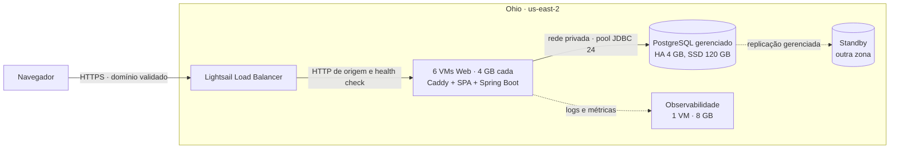

# Cenário alto · pico estadual

```mermaid
flowchart LR
    U["Navegador"]
    subgraph OH["Ohio · us-east-2"]
      L["Lightsail Load Balancer"]
      W["6 VMs Web · 4 GB cada<br/>Caddy + SPA + Spring Boot"]
      P[("PostgreSQL gerenciado<br/>HA 4 GB, SSD 120 GB")]
      O["Observabilidade<br/>1 VM · 8 GB"]
      S[("Standby<br/>outra zona")]
      P -. "replicação gerenciada" .-> S
      L -->|"HTTP de origem e health check"| W
      W -->|"rede privada · pool JDBC 24"| P
      W -. "logs e métricas" .-> O
    end
    U -->|"HTTPS · domínio validado"| L
```
