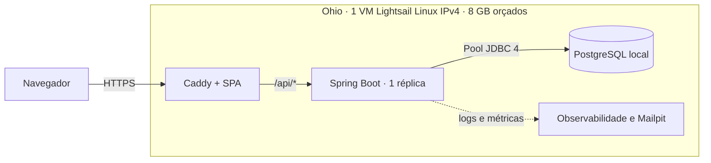

# Cenário baixo · piloto

```mermaid
flowchart LR
    U["Navegador"]
    subgraph VM["Ohio · 1 VM Lightsail Linux IPv4 · 8 GB orçados"]
      C["Caddy + SPA"] -->|"/api/*"| A["Spring Boot · 1 réplica"]
      A -->|"Pool JDBC 4"| P[("PostgreSQL local")]
      A -. "logs e métricas" .-> O["Observabilidade e Mailpit"]
    end
    U -->|"HTTPS"| C
```
