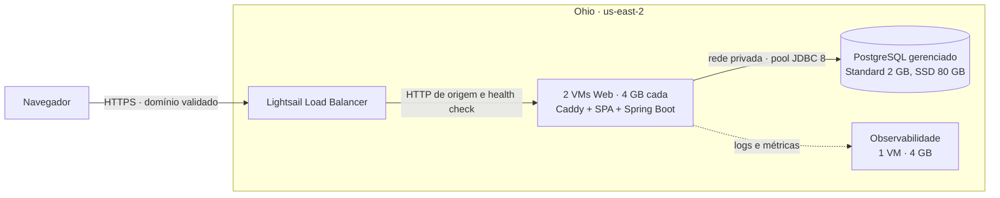

# Cenário moderado · operação regional

```mermaid
flowchart LR
    U["Navegador"]
    subgraph OH["Ohio · us-east-2"]
      L["Lightsail Load Balancer"]
      W["2 VMs Web · 4 GB cada<br/>Caddy + SPA + Spring Boot"]
      P[("PostgreSQL gerenciado<br/>Standard 2 GB, SSD 80 GB")]
      O["Observabilidade<br/>1 VM · 4 GB"]

      L -->|"HTTP de origem e health check"| W
      W -->|"rede privada · pool JDBC 8"| P
      W -. "logs e métricas" .-> O
    end
    U -->|"HTTPS · domínio validado"| L
```
