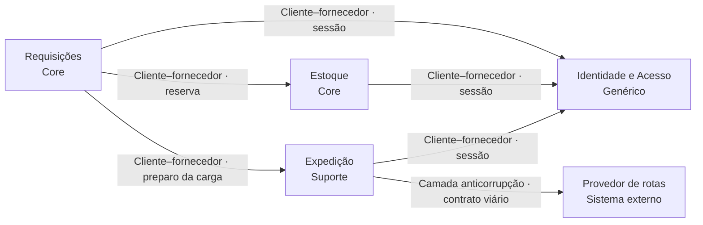

# Mapa de contextos

As setas indicam o sentido da solicitação, do cliente para o fornecedor.

```mermaid
flowchart LR
    R["Requisições<br/>Core"]
    B["Estoque<br/>Core"]
    E["Expedição<br/>Suporte"]
    I["Identidade e Acesso<br/>Genérico"]
    O["Provedor de rotas<br/>Sistema externo"]
    R -->|"Cliente–fornecedor · reserva"| B
    R -->|"Cliente–fornecedor · preparo da carga"| E
    R -->|"Cliente–fornecedor · sessão"| I
    B -->|"Cliente–fornecedor · sessão"| I
    E -->|"Cliente–fornecedor · sessão"| I
    E -->|"Camada anticorrupção · contrato viário"| O
```

